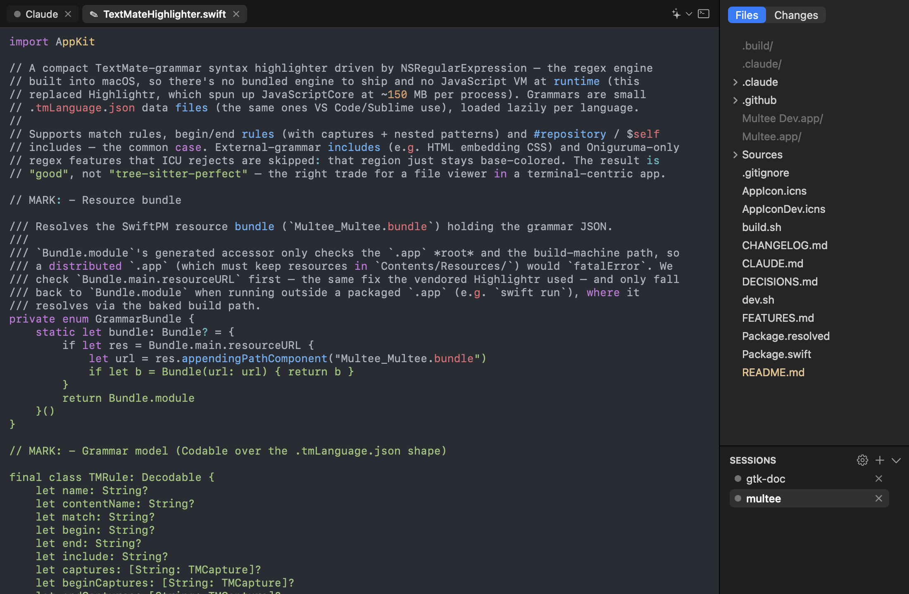
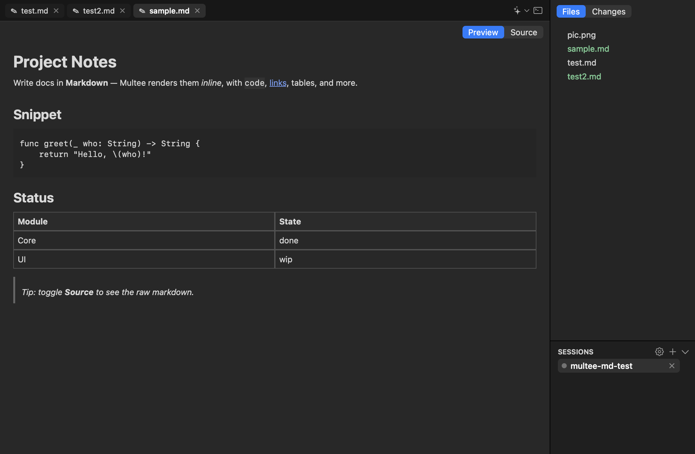
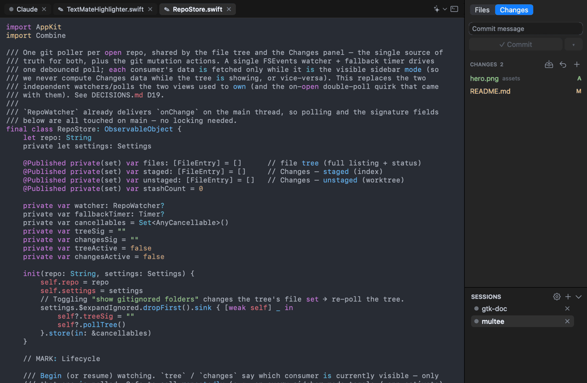
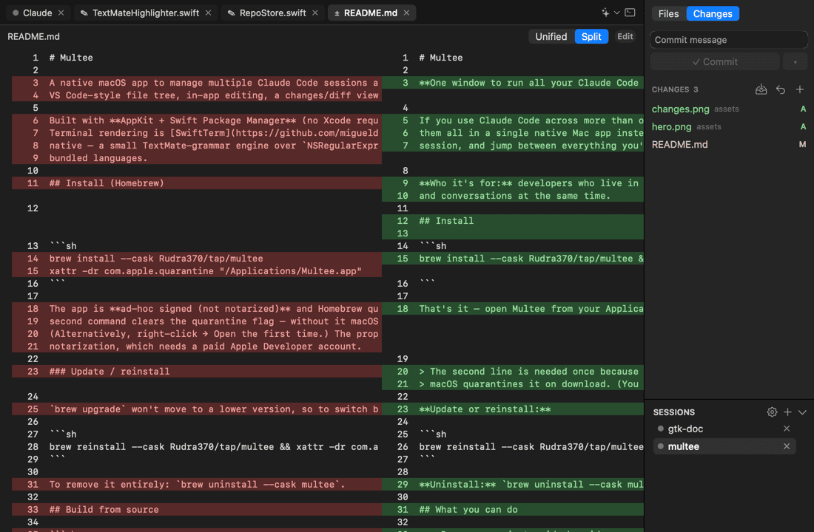

<div align="center">


# Multee

**One window to run all your Claude Code sessions.**

[](https://github.com/Rudra370/multee/releases)
[](https://github.com/Rudra370/multee/releases)
[](#why-multee)



</div>

If you use **Claude Code** across more than one project — or run several sessions at once — Multee keeps
them all in a single, fast, native Mac app instead of a pile of terminal tabs. Open a project, start a
Claude session, and move between everything you're working on at a glance.

**Who it's for:** developers who live in Claude Code and want a calmer way to juggle multiple projects
and conversations side by side.

## Install

```sh
brew install --cask Rudra370/tap/multee
xattr -dr com.apple.quarantine "/Applications/Multee.app"
```

Then open **Multee** from your Applications folder.

> The second line is needed just once: the app isn't signed by a paid Apple Developer account yet, so
> macOS quarantines it on download. (You can also right-click the app → **Open** the first time.)

<details>
<summary><b>Update or uninstall</b></summary>

```sh
# update / reinstall
brew reinstall --cask Rudra370/tap/multee && xattr -dr com.apple.quarantine "/Applications/Multee.app"

# uninstall
brew uninstall --cask multee
```

</details>

## What you can do

- **Run many projects side by side** — each project is a session; switch between them instantly.
- **Tabs for everything** — Claude sessions, terminals, file viewers, and diffs, together in one window.
- **Know what needs you** — a colored dot per session shows whether Claude is working, waiting on you, or
  idle, with an optional sound when it finishes or needs attention.
- **Browse your code** — a file tree with git-status colors and a syntax-highlighted viewer (~30 languages).
- **Open any file** — images and icons (PNG/JPG/SVG/`.icns`) with zoom &amp; pan, and Markdown files render as
  a formatted **preview** (headings, code with highlighting, tables, inline images) with a source toggle.
- **Review changes** — stage, commit, discard, and view diffs without leaving the app.
- **Pick up where you left off** — sessions, tabs, and Claude conversations come back when you reopen Multee.
- **Make it yours** — drag tabs to reorder, set default Claude arguments, font size, and more.

<p align="center">
  <br>
  <b>Markdown, rendered</b>
</p>

<table>
  <tr>
    <td width="50%"></td>
    <td width="50%"></td>
  </tr>
  <tr>
    <td align="center"><b>Review &amp; commit changes</b></td>
    <td align="center"><b>Side-by-side diffs</b></td>
  </tr>
</table>

## Why Multee

- **Tiny.** The whole app is under 6 MB.
- **Fast and light.** Built natively for macOS (pure AppKit — no Electron, no bundled browser), so it
  sips memory and sits at near-zero CPU when you're not doing anything.
- **Feels like a Mac app.** Native menus, cursors, and windows that behave exactly the way you expect.

---

<sub>For developers: see **[CLAUDE.md](CLAUDE.md)** to build &amp; contribute, **[FEATURES.md](FEATURES.md)**
for how each feature works, and **[DECISIONS.md](DECISIONS.md)** for why it's built this way.</sub>
